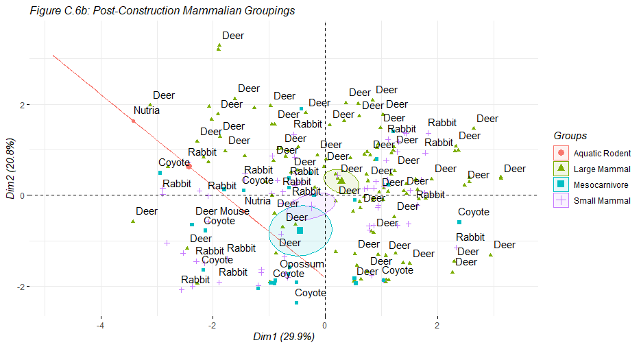
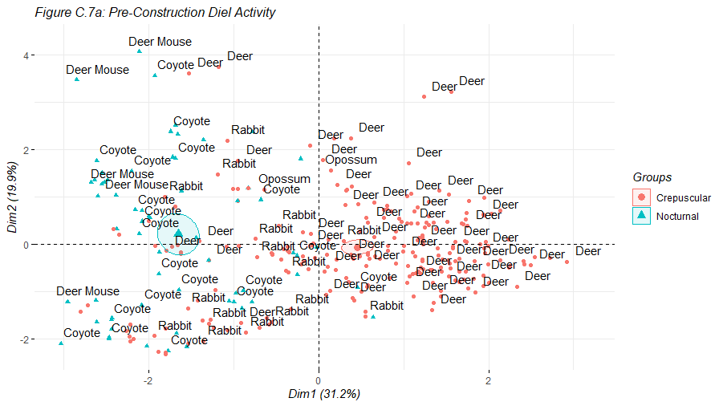
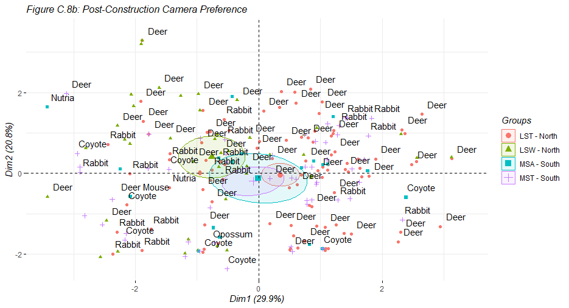
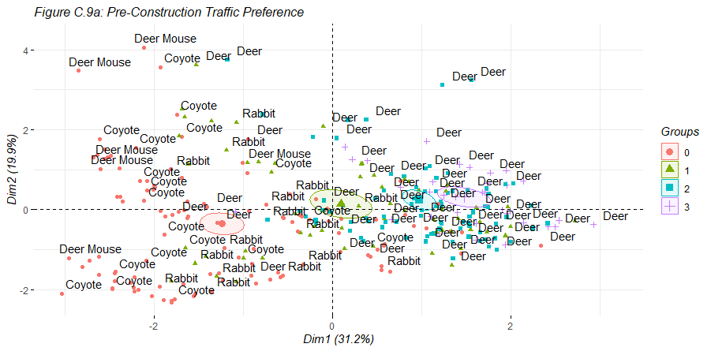

# Principle Components Analysis

This is the appendix of principle components analysis plot output. This section is organized as follows:

- Numerical Tables for Plot Generation
- Scree Plots
- Individual Plots
- Variable Plots
- Biplot graphs
- Individual Plots with Overlaid Categorical Ellipses
- R Code

# Numerical Tables for Plot Generation

Three types of tables are calculated in order to derive the points for plot generation. These are:

- __Coordinates__ - The coordinates of each variable that are used to create a scatter plot. Note, there are seven values for each variable, meaning we can plot them into seven dimensions. For ease of interpretation, we will limit ourselves to just two dimensions.
- __Quality of Represenation__ - This is the square of the coordinate of each variable. This number is the sum of square distance of the observation when the original data point is projected onto a component.
- __Contribution__ - For each relative principal component, this is a variable's percent contribution to that specific dimension.

### _PCA Coordinates_
```{r echo = FALSE, results = "asis", message = FALSE}
library(readxl)
library(factoextra)
library(FactoMineR)
library(knitr)
library(gridExtra)
pre <- read_excel("pca.xlsx", sheet = "pca.pre.c")
post <- read_excel("pca.xlsx", sheet = "pca.post.c")
pre <- data.frame(pre)
post <- data.frame(post)
pre.n <- pre[1:7]
post.n <- post[1:7]
pca.pre <- prcomp(pre.n, scale = TRUE)
pca.post <- prcomp(post.n, scale = TRUE)
pre.eig <- get_eigenvalue(pca.pre)
post.eig <- get_eigenvalue(pca.post)
pre.vcf <- function(pre.load, comp.sdev){pre.load*comp.sdev}
pre.load <- pca.pre$rotation
pre.sdev <- pca.pre$sdev
pre.vcoord <- t(apply(pre.load, 1, pre.vcf, pre.sdev ))
pre.vc <- head(pre.vcoord[,1:7])
post.vcf <- function(post.load, comp.sdev){post.load*comp.sdev}
post.load <- pca.post$rotation
post.sdev <- pca.post$sdev
post.vcoord <- t(apply(post.load, 1, post.vcf, post.sdev))
post.vc <- head(post.vcoord[,1:7])
kable(pre.vc[1:6,1:7], caption = "Pre-Construction Variable Coordinates")
kable(post.vc[1:6,1:7], caption = "Post-Construction Variable Coordinates")
```

\newpage
# Numerical Tables for Plot Generation (Continued)
### _Variable Quality of Representation_

```{r echo = FALSE, results = "asis", message = FALSE}
pre.cos2 <- pre.vcoord^2
post.cos2 <- post.vcoord^2
kable(pre.cos2[1:6,1:7], caption = "Pre-Construction Variable Quality of Representation")
kable(post.cos2[1:6,1:7], caption = "Post-Construction Variable Quality of Representation")
```

### _Variable Contribution_

```{r echo = FALSE, results = "asis", message = FALSE}
pre.cc2 <- apply(pre.cos2, 2, sum)
contrib <- function(pre.cos2, pre.cc2){pre.cos2*100/pre.cc2}
pre.varc <- t(apply(pre.cos2, 1, contrib, pre.cc2))
pre.vcontrib <- head(pre.varc[,1:7])
post.cc2 <- apply(post.cos2, 2, sum)
contrib <- function(post.cos2, post.cc2){post.cos2*100/post.cc2}
post.varc <- t(apply(post.cos2, 1, contrib, post.cc2))
post.vcontrib <- head(post.varc[,1:7])
kable(pre.vcontrib[1:6,1:7], caption = "Pre-Construction Variable Dimension Contribution (%)")
kable(post.vcontrib[1:6,1:7], caption = "Post-Construction Variable Dimension Contribution (%)")
```

\newpage
# Scree Plots
```{r echo = FALSE, fig.height = 3}
pre.scree <- fviz_eig(pca.pre,
                      title = "Figure C.1a: Pre-Construction Scree Plot") + theme(plot.title = element_text(size=8), title = element_text(face = "italic"))

post.scree <- fviz_eig(pca.post,
                       title = "Figure C.1b: Post-Construction Scree Plot") + theme(plot.title = element_text(size=8), title = element_text(face = "italic"))

grid.arrange(pre.scree,post.scree, ncol=2)
```

As seen above, the scree plots for both pre and post-construction show many principle dimensions. This is not ideal as we cannot readily visualize 4 or more dimensions. Though we miss a great deal of detail by examining fewer plots, we can still gain a sense of understanding since there is already so much noise in the datasets. The following plots will only be shown in two dimensions for ease of interpretation. For three-dimensional principle components plots, please refer to the R-code at the end of this section.

# Individual Plots
```{r echo = FALSE, fig.height = 3}
pre.ind <- fviz_pca_ind(pca.pre,
                        col.ind = "cos2",
                        gradient.cols = c("#00AFBB", "#E7B800", "#FC4E07"),   #default R colors
                        repel = TRUE,
                        label = "none",
                        title = "Figure C.2a: Pre-Construction Individual Plot") + theme(plot.title = element_text(size=8), title = element_text(face = "italic"))

post.ind <- fviz_pca_ind(pca.post,
                        col.ind = "cos2",
                        gradient.cols = c("#00AFBB", "#E7B800", "#FC4E07"),   #default R colors
                        repel = TRUE,
                        label = "none",
                        title = "Figure C.2b: Post-Construction Individual Plot") + theme(plot.title = element_text(size=8), title = element_text(face = "italic"))

grid.arrange(pre.ind,post.ind, ncol=2)
```

These are the principle components individual contribution plots. The color indicates greater contribution to the dimensions in question. In this case, red means that an individual observation contributes a greater percentage of variation to a particular dimension. Conversely, the turqoise coloring indicates that a particular observation does not contribute much at all.

\newpage
# Variable Plots
```{r echo = FALSE, fig.height = 3}
pre.var <- fviz_pca_var(pca.pre,
                        col.var = "cos2",
                        gradient.cols = c("#00AFBB", "#E7B800", "#FC4E07"),   #default R colors
                        repel = TRUE,
                        title = "Figure C.3a: Pre-Construction Variable Plot") + theme(plot.title = element_text(size=8), title = element_text(face = "italic"))

post.var <- fviz_pca_var(pca.post,
                         col.var = "cos2",
                         gradient.cols = c("#00AFBB", "#E7B800", "#FC4E07"),   #default R colors
                         repel = TRUE,
                         title = "Figure C.3b: Post-Construction Variable Plot") + theme(plot.title = element_text(size=8), title = element_text(face = "italic"))

grid.arrange(pre.var,post.var, ncol=2)
```

Similar to the individual contribution plots above, these variable plots measure only the contribution that each collected variable provides relative to each other. Arrows that point away from each other indicate non-correlated data. Arrows that point in the same direction indicate more correlated data.

In this particular case, we note that precipitation and month are closely correlated. This makes sense give that precipitation amounts are often seasonal and go hand-in-hand with months. Additionally, we see strong correlation between daily minimum and maximum temperature. This is not surprising as we expect to see fairly consistent differences between daily highs and lows. Traffic appears to correlated with hour in both plots, again, this is to be expected.

# Biplots
```{r echo = FALSE, fig.height = 3}
pre.bp <- fviz_pca_biplot(pca.pre,
                         col.ind = "coral",
                         col.var = "#2f2091",
                         label = "var",
                         repel = TRUE,
                         title = "Figure C.4a: Pre-Construction Biplot") + theme(plot.title = element_text(size=8), title = element_text(face = "italic"))
                       

post.bp <- fviz_pca_biplot(pca.post,
                           col.ind = "cadetblue3",
                           col.var = "#2f2091",
                           label = "var",
                           repel = TRUE,
                           title = "Figure C.4b: Post-Construction Biplot") + theme(plot.title = element_text(size=8), title = element_text(face = "italic"))
                       
grid.arrange(pre.bp,post.bp, ncol=2)
```

These two biplots overlay variable contributions on top of the indivudal observations into a singular plot. This provides a succinct method to quickly evaluate how each observation corresponds with each variable.

# Individual Plots with Overlaid Categorical Ellipses

The following plots show the relative grouping the several categorical variables onto the individual principle components plot. Each plot will have an ellipses generated on top of a pre or post-construction individiual pca plot. Each generated ellipse has a center that is the mean of all relative points. 

For example, in the 'Pre-Construction: Species Groupings' plot, we see that deer and coyote have overlapping ellipses. This is useful for a snap shot of how the species interact. Upon closer examination, we see more dense groupings of deer and coyotes that are further away from each other. The means of the ellipsis are sensitive outliers and further examination of the data points would be prudent before finalizing any conclusions.

Each page will have pre-construction and post-construction plots adjacent to each other. Please note that due to variation in sampling methodology, any changes due to the road construction cannot be reliably determined. In that light, they can serve to highlight how the activity of the populations in the two datasets behave.

The categorical plots are generated in this order:

- Species Groupings
- Mammlian Groupings
- Diety Activity Groupings
- Traffic Preference


\newpage
##_Categorical Plots: Species_

The plots, below, show how each species interacts with each other. This could provide a useful framework to approach future culvert design to better improve usability for specific groups instead of specific species. Generally speaking, we can see that deer and coyote form two of the larger, more distinct groups. Additionally, we see that deer mice and coyote are simiarly grouped. This specific interaction could suggest a predator-prey relationship as well as culvert preference due to their smaller size.


\newpage
##_Categorical Plots: Mammalian Groups_

Simiar to the species plots above, we broaden our scope of definition and sort our species counts by mammalian groups. Each species observation is still noted, but the colors here refer to the key seen on the right-hand side of the plots. Pre-construction shows a clear grouping of deer while every other mammalian group are more similar to each other. In post-construction, we see the variations between the groups are more clustered together. This could indicate that the culverts presents a funneling effect.




\newpage
##_Categorical Plots: Diel Activity Groups_

Here, we can further our scope from mammalian groups into specific hourly activity preference that species are known for. There are two groups - crepuscular and nocturnal. Crepuscular animals are more active during the dawn and evening hours while nocturnal animals are more active during night time hours. In pre-construction, we see the two categories are distinctly grouped - as is expected. These groupings still exist in post-construction, yet the variability is more evenly mixed and centered. If these two groups are merging, then it could further suppport the notion that the culverts present a funneling effect.




\newpage
##_Categorical Plots: Camera Preference_

When examining the general groupings for camera preference, we notice some intrigueing changes in behavior. In pre-construction observations, there are two distinct groupings. The first grouping involves camera camera _2 North_ and _4 South_ while the second group involves camera _1 North_ and camera _3 South_. In pre-construction, this particular grouping is likely due to the angle of the cameras. In post-construction, however, all of the cameras seem to have more overlap. This could suppor the notion that the culverts present a funneling effect.




\newpage
##_Categorical Plots: Traffic_

When overlaid with recent traffic data onto our historical data, we can see some relationship with the presence of traffic. Pre-construction shows that only deer have almost no traffic preference and will be present regardless of activity. In post-construction, we see a similar trend. However, it seems that only coyotes have a strong preference for traffic while every other species does not seem affected. 

It should strongly noted that the datasets used for the traffic analysis are severely mismatched. The observational data sets are from the year 2015-2016 and 2018-2019 while the traffic data is from 2020 and in a location that is due approximately 300 meters due north at Boeckman Road. It could be assumed that populations that access the Boeckman Road and Kinsman Road crossings are the same populations. However, there is no empirical basis for this assumption. 

The results here should only be used to encourage the need for additional study with improved sampling methods.




\newpage
# R Code (1 of 8)
```{r eval=FALSE}

# Import data set from github
# Github Access URL: https://github.com/Kinsman-Road/rcode.git
library(readxl)
pre <- read_excel("PCA/pca.xlsx", sheet = "pca.pre.c")
post <- read_excel("PCA/pca.xlsx", sheet = "pca.post.c")

# Prepare dataframes
pre <- data.frame(pre)
post <- data.frame(post)

pre.n <- pre[1:7]      #create dataframes with only numerical columns from pre
post.n <- post[1:7]    #create dataframes with only numerical columns from post

# Performing principal components analysis
library(factoextra)
library(FactoMineR)

pca.pre <- prcomp(pre.n, scale = TRUE)   #singular value decomposition
pca.post <- prcomp(post.n, scale = TRUE)   #singular value decomposition
pre.eig <- get_eigenvalue(pca.pre)
post.eig <- get_eigenvalue(pca.post)

# Calculate PCA coordinates

# Pre-Construction PCA Coordinates
pre.vcf <- function(pre.load, comp.sdev){pre.load*comp.sdev}
pre.load <- pca.pre$rotation
pre.sdev <- pca.pre$sdev
pre.vcoord <- t(apply(pre.load, 1, pre.vcf, pre.sdev ))
pre.vc <- head(pre.vcoord[,1:7])   #1:7 number of dimensions

# Post-Construction PCA Coordinates
post.vcf <- function(post.load, comp.sdev){post.load*comp.sdev}
post.load <- pca.post$rotation
post.sdev <- pca.post$sdev
post.vcoord <- t(apply(post.load, 1, post.vcf, post.sdev))
post.vc <- head(post.vcoord[,1:7])   #1:7 number of dimensions

pre.vc       #table of pre pca coords
post.vc      #table of post pca coords

# PCA Qualtity of Representation
pre.cos2 <- pre.vcoord^2
post.cos2 <- post.vcoord^2

pre.cos2     #table of contribution to each dimension
post.cos2    #table of contribution to each dimension
```

\newpage
# R Code (2 of 8)
```{r eval=FALSE}
# PCA Contributions to Each Given Component
pre.cc2 <- apply(pre.cos2, 2, sum)
contrib <- function(pre.cos2, pre.cc2){pre.cos2*100/pre.cc2}
pre.varc <- t(apply(pre.cos2, 1, contrib, pre.cc2))
pre.vcontrib <- head(pre.varc[,1:7])   #1:7 number of dimensions

post.cc2 <- apply(post.cos2, 2, sum)
contrib <- function(post.cos2, post.cc2){post.cos2*100/post.cc2}
post.varc <- t(apply(post.cos2, 1, contrib, post.cc2))
post.vcontrib <- head(post.varc[,1:7])   #1:7 number of dimensions

pre.vcontrib
post.vcontrib

# Creating a scree plot to determine principal dimensions of interest
pre.scree <- fviz_eig(pca.pre,
                      title = "Pre-Construction Scree Plot")

post.scree <- fviz_eig(pca.post,
                       title = "Post-Construction Scree Plot")
pre.scree
post.scree

# Creating contribution plot for individual observations
pre.ind <- fviz_pca_ind(pca.pre,
                        col.ind = "cos2",
                        gradient.cols = c("#00AFBB", "#E7B800", "#FC4E07"),   
                        repel = TRUE,
                        label = "none",
                        title = "Pre-Construction Individual Plot")

post.ind <- fviz_pca_ind(pca.post,
                        col.ind = "cos2",
                        gradient.cols = c("#00AFBB", "#E7B800", "#FC4E07"),   
                        repel = TRUE,
                        label = "none",
                        title = "Post-Construction Individual Plot")
pre.ind
post.ind
```

\newpage
# R Code (3 of 8)
```{r eval=FALSE}
# Creating contribution plot for variable contributions
pre.var <- fviz_pca_var(pca.pre,
                        col.var = "cos2",
                        gradient.cols = c("#00AFBB", "#E7B800", "#FC4E07"),   
                        repel = TRUE,
                        title = "Pre-Construction Variable Plot")

post.var <- fviz_pca_var(pca.post,
                         col.var = "cos2",
                         gradient.cols = c("#00AFBB", "#E7B800", "#FC4E07"),   
                         repel = TRUE,
                         title = "Post-Construction Variable Plot")
pre.var
post.var

# Creating a biplot(combination of ind + var plots)
pre.bp <- fviz_pca_biplot(pca.pre,
                         col.ind = "coral",
                         col.var = "#2f2091",
                         label = "var",
                         repel = TRUE,
                         title = "Pre-Construction Biplot")

post.bp <- fviz_pca_biplot(pca.post,
                           col.ind = "cadetblue3",
                           col.var = "#2f2091",
                           label = "var",
                           repel = TRUE,
                           title = "Post-Construction Biplot")
pre.bp
post.bp

# Creating 3D Observation Plots 
library(pca3d)

pre3d.species <- pca3d(pca.pre, group=pre$species)
pre3d.mcat <- pca3d(pca.pre, group=pre$category)
pre3d.dnc <- pca3d(pca.pre, group=pre$dnc)
pre3d.traffic <- pca3d(pca.pre, group=pre$traffic)

post3d.species <- pca3d(pca.post, group=post$species)
post3d.mcat <- pca3d(pca.post, group=post$category)
post3d.dnc <- pca3d(pca.post, group=post$dnc)
post3d.traffic <- pca3d(pca.post, group=post$traffic)
```
\newpage
# R Code (4 of 8)
```{r eval=FALSE}                                     
# Creating an individual PCA plot with ellipses for categories
# (1) First define categories as factors

# (1a) Pre categories
pre.g.species <- as.factor(pre$species[1:351])
pre.g.solar <- as.factor(pre$solar[1:351])
pre.g.cat <- as.factor(pre$category[1:351])
pre.g.cam <- as.factor(pre$camera[1:351])
pre.g.traffic <- as.factor(pre$traffic[1:351])
pre.g.dnc <- as.factor(pre$dnc[1:351])

# (1b) Post categories
post.g.species <- as.factor(post$species[1:221])
post.g.solar <- as.factor(post$solar[1:221])
post.g.cat <- as.factor(post$category[1:221])
post.g.cam <- as.factor(post$camera[1:221])
post.g.traffic <- as.factor(post$traffic[1:221])
post.g.dnc <- as.factor(post$dnc[1:221])

# (2) Produce ellipses PCA graphs for every factor   

# (2a) Pre-Construction Ellipses PCA categories
pre.species <- fviz_pca_ind(pca.pre,
                            col.ind = pre.g.species,
                            palette = c( ),
                            addEllipses = TRUE,
                            ellipse.type = "confidence",
                            legend.title = "Groups",
                            repel = TRUE,
                            label = "none",
                            title = "Pre-Construction: Species Groupings") + 
                   geom_text(
                            label=pre$species, 
                            nudge_x = 0.25, nudge_y = 0.25,
                            check_overlap = T)

pre.solar <- fviz_pca_ind(pca.pre,
                            col.ind = pre.g.solar,
                            palette = c( ),
                            addEllipses = TRUE,
                            ellipse.type = "confidence",
                            legend.title = "Groups",
                            repel = TRUE,
                            label = "none",
                            title = "Pre-Construction: Daylight Preference") + 
                   geom_text(
                            label=pre$species, 
                            nudge_x = 0.25, nudge_y = 0.25,
                            check_overlap = T)
```
\newpage
# R Code (5 of 8)
```{r eval=FALSE}
# (2a) Pre-Construction Ellipses PCA categories (Continued)
pre.cat <- fviz_pca_ind(pca.pre,
                            col.ind = pre.g.cat,
                            palette = c( ),
                            addEllipses = TRUE,
                            ellipse.type = "confidence",
                            legend.title = "Groups",
                            repel = TRUE,
                            label = "none",
                            title = "Pre-Construction: Mammalian Groupings") + 
                   geom_text(
                            label=pre$species, 
                            nudge_x = 0.25, nudge_y = 0.25,
                            check_overlap = T)

pre.cam <- fviz_pca_ind(pca.pre,
                            col.ind = pre.g.cam,
                            palette = c( ),
                            addEllipses = TRUE,
                            ellipse.type = "confidence",
                            legend.title = "Groups",
                            repel = TRUE,
                            label = "none",
                            title = "Pre-Construction: Camera Preference") + 
                   geom_text(
                            label=pre$species, 
                            nudge_x = 0.25, nudge_y = 0.25,
                            check_overlap = T)

pre.traffic <- fviz_pca_ind(pca.pre,
                           col.ind = pre.g.traffic,
                           palette = c( ),
                           addEllipses = TRUE,
                           ellipse.type = "confidence",
                           legend.title = "Groups",
                           repel = TRUE,
                           label = "none",
                           title = "Pre-Construction: Traffic Preference") + 
                  geom_text(
                           label=pre$species, 
                           nudge_x = 0.25, nudge_y = 0.25,
                           check_overlap = T)
```
\newpage
# R Code (6 of 8)
```{r eval=FALSE}
# (2a) Pre-Construction Ellipses PCA categories (Continued)
pre.dnc <- fviz_pca_ind(pca.pre,
                            col.ind = pre.g.dnc,
                            palette = c(""),
                            addEllipses = TRUE,
                            ellipse.type = "confidence",
                            legend.title = "groups",
                            repel = TRUE,
                            label = "none",
                            title = "Pre-Construction: D/N/C Category") + 
                   geom_text(
                            label=pre$species, 
                            nudge_x = 0.25, nudge_y = 0.25,
                            check_overlap = T)

# (2b) Post-Construction Ellipses PCA categories
post.species <- fviz_pca_ind(pca.post,
                            col.ind = post.g.species,
                            palette = c( ),
                            addEllipses = TRUE,
                            ellipse.type = "confidence",
                            legend.title = "Groups",
                            repel = TRUE,
                            label = "none",
                            title = "Post-Construction: Species Groupings") + 
                   geom_text(
                            label=post$species, 
                            nudge_x = 0.25, nudge_y = 0.25,
                            check_overlap = T)

post.solar <- fviz_pca_ind(pca.post,
                          col.ind = post.g.solar,
                          palette = c( ),
                          addEllipses = TRUE,
                          ellipse.type = "confidence",
                          legend.title = "Groups",
                          repel = TRUE,
                          label = "none",
                          title = "Post-Construction: Daylight preference") + 
                 geom_text(
                          label=post$species, 
                          nudge_x = 0.25, nudge_y = 0.25,
                          check_overlap = T)
```
\newpage
# R Code (7 of 8)
```{r eval=FALSE}
# (2b) Post-Construction Ellipses PCA categories (Continued)
post.cat <- fviz_pca_ind(pca.post,
                        col.ind = post.g.cat,
                        palette = c( ),
                        addEllipses = TRUE,
                        ellipse.type = "confidence",
                        legend.title = "Groups",
                        repel = TRUE,
                        label = "none",
                        title = "Post-Construction: Mammalian Groupings") + 
               geom_text(
                        label=post$species, 
                        nudge_x = 0.25, nudge_y = 0.25,
                        check_overlap = T)

post.cam <- fviz_pca_ind(pca.post,
                        col.ind = post.g.cam,
                        palette = c( ),
                        addEllipses = TRUE,
                        ellipse.type = "confidence",
                        legend.title = "Groups",
                        repel = TRUE,
                        label = "none",
                        title = "Post-Construction: Camera Preference") + 
               geom_text(
                        label=post$species, 
                        nudge_x = 0.25, nudge_y = 0.25,
                        check_overlap = T)

post.traffic <- fviz_pca_ind(pca.post,
                            col.ind = post.g.traffic,
                            palette = c( ),
                            addEllipses = TRUE,
                            ellipse.type = "confidence",
                            legend.title = "Groups",
                            repel = TRUE,
                            label = "none",
                            title = "Post-Construction: Traffic Preference") + 
                   geom_text(
                            label=post$species, 
                            nudge_x = 0.25, nudge_y = 0.25,
                            check_overlap = T)
```
\newpage
# R Code (8 of 8)
```{r eval=FALSE}
# (2b) Post-Construction Ellipses PCA categories (Continued)
post.dnc <- fviz_pca_ind(pca.post,
                             col.ind = post.g.dnc,
                             palette = c( ),
                             addEllipses = TRUE,
                             ellipse.type = "confidence",
                             legend.title = "Groups",
                             repel = TRUE,
                             label = "none",
                             title = "Post-Construction: D/N/C Category") + 
                    geom_text(
                             label=post$species, 
                             nudge_x = 0.25, nudge_y = 0.25,
                             check_overlap = T)

# Generate Plots
pre.scree
pre.ind
pre.var
pre.bp
pre.species
pre.solar
pre.cat
pre.cam
pre.traffic
pre.dnc

post.scree
post.ind
post.var
post.bp
post.species
post.solar
post.cat
post.cam
post.traffic
post.dnc
```