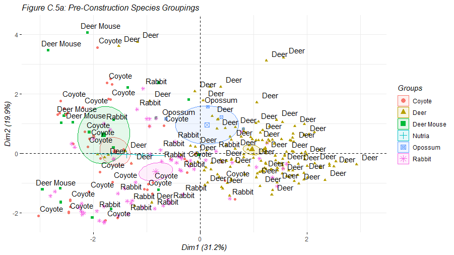
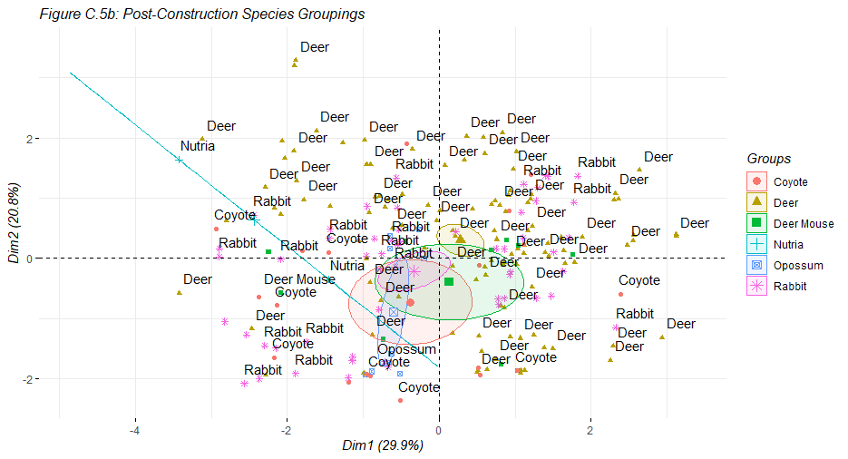
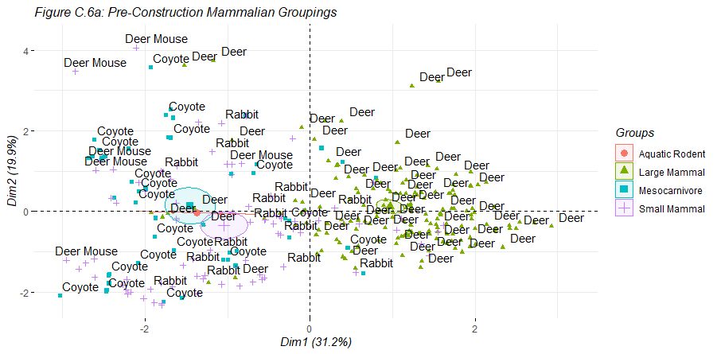
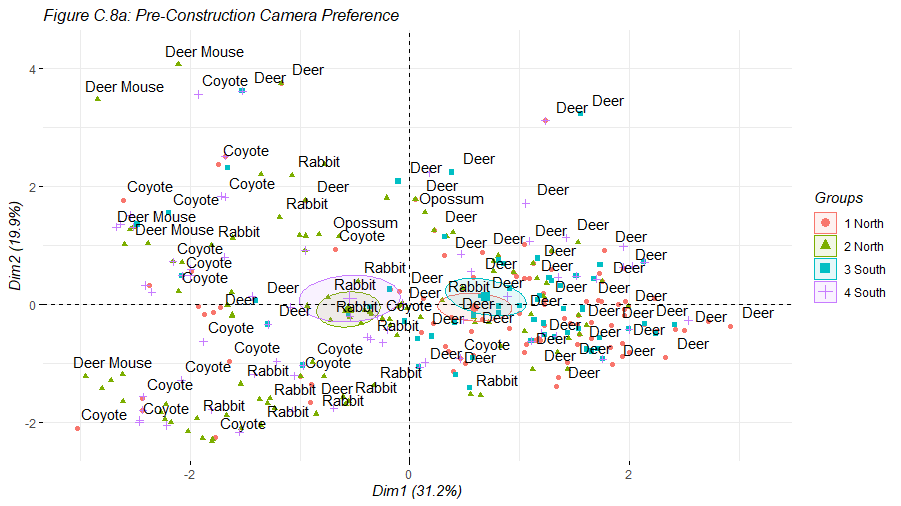
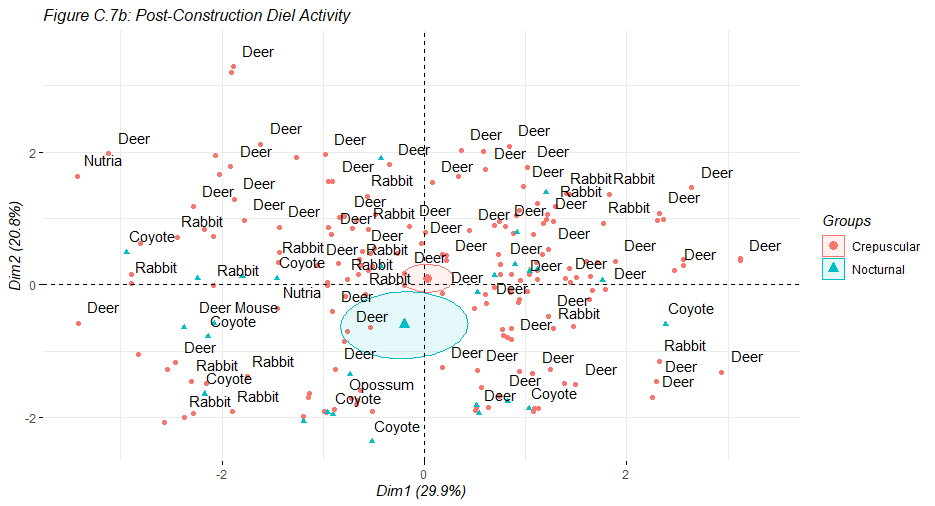

# Principal Components Analysis

This is the appendix of principal components analysis plot output. This section is organized as follows:

- Coordinates, Quality of Representation, and Contributions
- Individual Plots, Variable Plots, and Biplot graphs
- Individual Plots with Overlaid Categorical Ellipses

# Coordinates, Quality of Representation, and Contributions

# Scree Plots, Individual Plots, Variable Plots, and Biplots

# Individual Plots with Overlaid Categorical Ellipses

